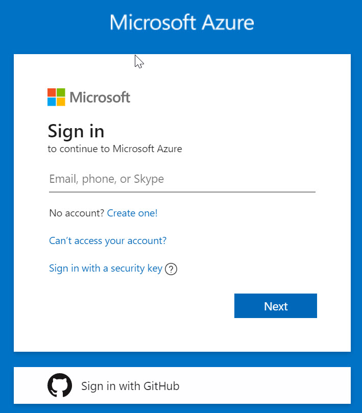
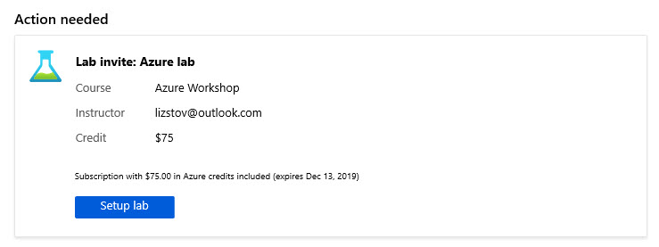

# Microsoft Azure Skills Workshop for Faculty
Welcome to Microsoft Azure Workshop Content Repo, explore Azure (cloud computing services) and it's Artificial Intelligence capabilities.

This repo will help you navigate Azure and identify the Azure services to enable data science in your research or classroom. What AI solutions and services are offered by Azure? How do I stream data from a device? How do I store different types of data? How can I extract information from across multiple documents and databases? How do I get the processing power I need for compute intense activities?

To complete the workshops you will require an Azure subscription. Follow the instructions [here](AzureSignUpPersonalAccount.md) to activate your Azure subscription and credits.

If you are unable to attend the entire workshop, use the resources below to learn the material at your own pace. 

<!-- Your feedback is appreciated as we continue to improve this workshop.  -->

The content is divided up into two sections:
1. [Azure Overview](#Azure-Overview)
    * [Introduction to Cloud and Navigating Azure](#Introduction-to-Cloud-and-Navigating-Azure)
    * [Azure Services](#Azure-Services)
2. [Hands-on Workshops](#Hands-on-Workshops)
    * [Data Science Overview](#Data-Science-Overview)
    * [Azure Data Science services overview](#Azure-Data-Science-Services-Overview)
    * [Anomaly Detection using Anomaly Detector API](#Anomaly-Detection-using-Anomaly-Detector-API)
    * [Intelligent Search using Azure Search](#Intelligent-Search-using-Azure-Search)
    * [Image Analysis](#Image-Analysis)
        * [Using Computer Vision API](#Using-Computer-Vision-API)
        * [Using Custom Vision](#Using-Custom-Vision)
    * [IoT through IoT Hub](#IoT-through-IoT-Hub)
    * [Train your own model using Microsoft Azure Notebooks](#Train-your-own-model-using-Microsoft-Azure-Notebooks)

## Azure Overview
### Introduction to Cloud and Navigating Azure 
| Topic | Description | 
| -------- | -------- |
| [Introduction to cloud](https://docs.microsoft.com/en-us/learn/modules/principles-cloud-computing/index) | Explore the core concepts of cloud computing and how it can help your business |
| [Azure subscriptions and accounts](https://docs.microsoft.com/en-us/learn/modules/create-an-azure-account/index) | Learn about accounts and subscriptions and how to authenticate access with Azure Active Directory |
| [Azure portal](https://docs.microsoft.com/en-us/learn/modules/tour-azure-portal/index) | Tour the Azure portal features and services, and customize the portal |
| [Azure CLI](https://docs.microsoft.com/en-us/learn/modules/control-azure-services-with-cli/index) | Install the Azure CLI locally and use it to manage Azure resources. |  

### Azure Services
| Topic | Description |
| -------- | -------- | 
| [Azure Compute options](https://docs.microsoft.com/en-us/learn/modules/intro-to-azure-compute/index) | Review the Azure Compute services and explore how they can solve common business needs: VM, Containers,Azure App, Service, Serverless |
| [Azure service options](https://docs.microsoft.com/en-us/learn/modules/choose-azure-service-to-integrate-and-automate-business-processes/index) | Learn about different ways to host and execute code or workflows without using VMs incuding Azure Functions, Microsoft Flow, Azure Logic Appps, and Azure Webjobs. |
| [Azure storage options](https://docs.microsoft.com/en-us/learn/modules/choose-storage-approach-in-azure/) | Learn how using Azure Storage, Azure SQL Database, and Azure Cosmos DB - or a combination of them - for your business scenario is the best way to get the most performant solution. |
| [Azure AI strategy and solutions](https://docs.microsoft.com/en-us/learn/modules/azure-artificial-intelligence/) | This module provides an overview of Azure AI and demonstrates how Microsoft tools, services, and infrastructure can help make AI real for your organization, whether you want to unlock insights from your latent data with knowledge mining, develop your own AI models with machine learning, or build immersive apps using AI. |
| [Azure costs](https://docs.microsoft.com/en-us/learn/modules/predict-costs-and-optimize-spending/index) | Cost is one of the most important aspects fo the cloud and can have a massive impact on your business. Azure has several toosl available to help you get a better understanding of cloud spend and some best practices that you can leverage to help you save money. |

## Hands-on Workshops
### Data Science Overview
Still trying to understand Data Science? This self-paced lesson will walk you through the Data Science process from end to end.

| Name | Type | Estimated time to complete | Abstract | Hyperlink |
| --- | --- | --- | --- | --- |
| Introduction to Data Science in Azure | Lesson | 55 minutes |  Learn the data science process and the steps involved, and explore the specialized data science roles. | [https://docs.microsoft.com/en-us/learn/modules/intro-to-data-science-in-azure/index](https://docs.microsoft.com/en-us/learn/modules/intro-to-data-science-in-azure/index) |

### Azure Data Science Services Overview
Already building your own machine learning models and neural networks? This self-paced lesson will walk you through each of the Azure machine learning products, identify key features of each product and describe what use case each product applies to.

| Name | Type | Estimated time to complete | Abstract | Hyperlink |
| --- | --- | --- | --- | --- |
| Choose the Data Science service in Azure you need | Lesson | 45 minutes |  Learn each of the Azure machine learning products, identify key features of each product and describe what use case each product applies to. | [https://docs.microsoft.com/en-us/learn/modules/choose-data-science-option-in-azure/index](https://docs.microsoft.com/en-us/learn/modules/choose-data-science-option-in-azure/index) |

### Anomaly Detection using Anomaly Detector API
The Anomaly Detector API lets you monitor and detect abnormalities in your time series data without previous experience in machine learning. The RESTful API adapts by automatically identifying and applying the best fitting statistical models to your data, regardless of industry, scenario, or data volume.

| Name | Type | Estimated time to complete | Abstract | Hyperlink |
| --- | --- | --- | --- | --- |
| What is the Anomaly Detector API | Hands-On | 30 minutes |  Try an interactive demo to understand how Anomaly Detector works, then use Azure Notebooks to see how the Anomaly Detector API can be used to detect anomalies that might exist as a batch, or as a single point in a data set. | [https://docs.microsoft.com/en-us/azure/cognitive-services/anomaly-detector/overview](https://docs.microsoft.com/en-us/azure/cognitive-services/anomaly-detector/overview) |
| Quickstart: Detect anomalies in your time series data using the Anomaly Detector REST API and Python | Hands-On | 30 minutes | Create a Python, Java, or C# application to read through a JSON file containing time series data and identify the anomalies. This lab requires a development environment to edit and execute the application. If you do not have one installed, you can install Visual Studio Code on Windows, macOS, or Linux (https://code.visualstudio.com/) | [https://docs.microsoft.com/en-us/azure/cognitive-services/anomaly-detector/quickstarts/detect-data-anomalies-python](https://docs.microsoft.com/en-us/azure/cognitive-services/anomaly-detector/quickstarts/detect-data-anomalies-python) |

### Intelligent Search using Azure Search
Azure Search adds a rich search experience over private, heterogeneous content in web, mobile, and enterprise applications. Consolidate heterogeneous content types into a private, single, searchable index. Index unstructured text, or extract text and information from image files using the cognitive search feature to add AI processing.  Handle language-specific linguistics with Lucene, Microsoft or custom analyzers.

| Name | Type | Estimated time to complete | Abstract | Hyperlink |
| --- | --- | --- | --- | --- |
| Quickstart: Create an Azure Search service in the portal | Hands-On | 30 minutes | Create an Azure Search resource in the Azure portal. | [https://docs.microsoft.com/en-us/azure/search/search-create-service-portal](https://docs.microsoft.com/en-us/azure/search/search-create-service-portal) |
| Quickstart: Create an Azure Search index in the portal | Hands-On | 45 minutes | Import a sample data set into Azure Search and generate an index for the data. Use Search explorer to execute queries and explore full text search, filters, facets, fuzzy search and geosearch. | [https://docs.microsoft.com/en-us/azure/search/search-get-started-portal](https://docs.microsoft.com/en-us/azure/search/search-get-started-portal) |
| Quickstart:Create an AI enrichment pipeline using Cognitive skills in Azure search | Hands-On | 45 minutes |  Azure Search integrates with Cognitive Services, adding content extraction, natural language processing (NLP), and image processing skills to an Azure Search indexing pipeline, making unsearchable or unstructured content more searchable In this quickstart, create your first enrichment pipeline in the Azure portal. Upload sample documents into Azure Blob storage, create an index, add cognitive indexing and enrichment, and use Search explorer to query the enriched data. | [https://docs.microsoft.com/en-us/azure/search/cognitive-search-quickstart-blob](https://docs.microsoft.com/en-us/azure/search/cognitive-search-quickstart-blob) |

### Image Analysis
#### Using Computer Vision API
The Computer Vision API provides developers with access to advanced algorithms for processing images and returning information. By uploading an image or specifying an image URL, Microsoft Computer Vision algorithms can analyze visual content in different ways based on inputs and user choices.

| Name | Type | Estimated time to complete | Abstract | Hyperlink |
| --- | --- | --- | --- | --- |
| Process images with the Computer Vision service | Hands-On | 30 minLearn | Use the Computer Vision API to analyze images for insights, extract text from images, and generate high-quality thumbnails. | [https://docs.microsoft.com/en-us/learn/modules/create-computer-vision-service-to-classify-images/](https://docs.microsoft.com/en-us/learn/modules/create-computer-vision-service-to-classify-images/) |

#### Using Custom Vision
Azure Custom Vision is a cognitive service that lets you build, deploy, and improve your own image classifiers. An image classifier is an AI service that applies labels (which represent classes) to images, according to their visual characteristics. Unlike the Computer Vision service, Custom Vision allows you to determine the labels to apply.

| Name | Type | Estimated time to complete | Abstract | Hyperlink |
| --- | --- | --- | --- | --- |
| Classify images with the Microsoft Custom Vision Service | Hands-On | 40 mi Learn | Create, train and test a custom image classification model using the Custom Vision Service to accurately identify paintings from famous artists. | [https://docs.microsoft.com/en-us/learn/modules/classify-images-with-custom-vision-service/](https://docs.microsoft.com/en-us/learn/modules/classify-images-with-custom-vision-service/) |

### IoT through IoT Hub
IoT Hub is a managed service that acts as a central message hub for bi-directional communication between your IoT application and the devices it manages. You can use Azure IoT Hub to build IoT solutions with reliable and secure communications between millions of IoT devices and a cloud-hosted solution backend. You can connect virtually any device to IoT Hub.

| Name | Type | Estimated time to complete | Abstract | Hyperlink |
| --- | --- | --- | --- | --- |
| What is Azure IoT Hub? | Lesson | 10 minutes | Learn the capabilities of Azure IoT Hub and how it integrates with other services. | [https://docs.microsoft.com/en-ca/azure/iot-hub/about-iot-hub](https://docs.microsoft.com/en-ca/azure/iot-hub/about-iot-hub) |
| Quickstart: Send telemetry from a device to an IoT hub and read it with a back-end application | Hands-On | 45 minutes  | Create an IoT hub and register a device with the hub then use two pre-written applications to send and read telemetry. This lab can be completed using Python, Java, Node.js, C, .NET,  Android, or iOS. This lab requires a development environment to edit and execute the application. If you do not have one installed, you can install Visual Studio Code on Windows, macOS, or Linux (https://code.visualstudio.com/) | [https://docs.microsoft.com/en-ca/azure/iot-hub/quickstart-send-telemetry-node](https://docs.microsoft.com/en-ca/azure/iot-hub/quickstart-send-telemetry-node) |

### Train your own model using Microsoft Azure Notebooks
Microsoft Azure Notebooks are the implementation of Jupyter Notebooks on Azure. A Jupyter Notebook allows you to create and share documents that contain live code, equations, visualizations and explanatory text. Uses include: data cleaning and transformation, numerical simulation, statistical modeling, machine learning and much more. Jupyter supports many different programming languages. On Azure Notebooks we currently support Python 2 and 3, F#, and R.

| Name | Type | Estimated time to complete | Abstract | Hyperlink |
| --- | --- | --- | --- | --- |
| Analyze climate data with Azure Notebooks | Hands-On | 45 minutes | Create a Jupyter notebook to analyze climate data and use popular libraries such as scikit-learn, NumPy, and Seaborn to extract information from the data and create visualizations. | [https://docs.microsoft.com/en-us/learn/modules/analyze-climate-data-with-azure-notebooks/index](https://docs.microsoft.com/en-us/learn/modules/analyze-climate-data-with-azure-notebooks/index) |

## Joining an Azure classroom
### Step 1: Set up a Microsoft account
In your browser, launch an in private/incognito window.

Navigate to the [Azure portal](https://portal.azure.com) and log in with your Microsoft account. You do **NOT** need to sign up for any Azure trials, you will be provided with an Azure subscription and credits to complete the workshop.

If you do not have a Microsoft account you can create one at [account.microsoft.com](https://account.microsoft.com).

### Step 2: Activate your Azure credits for the workshop
Using a in private/incognito browsing window, go to [aka.ms/joinedu](https://aka.ms/joinedu).

Sign in with your Microsoft credentials:

Enter your 5-digit invitation code

After entering the code, you will be redirected to the Education Hub.

### Step 3: Setup lab
Select **Setup Lab** in the Action pane. This will create your subscription and allocate your credit to complete the workshop.

